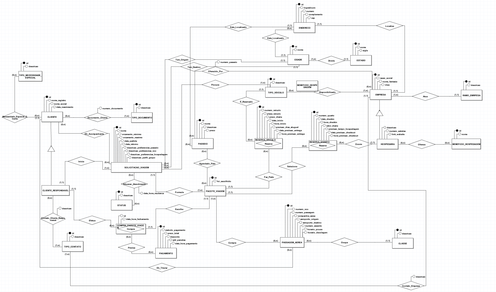

# TRABALHO 01:  Viagens BSI
Trabalho desenvolvido durante a disciplina de BD1 e AS (4º período de BSI)

# Sumário

### 1. COMPONENTES 
Integrantes do grupo 
Beatriz Auer Mariano: biaauer03@gmail.com 
Mateus Maioli Giacomin: matgiacomin@gmail.com 
 

### 2. INTRODUÇÃO 
O presente trabalho busca trabalhar diversos conceitos de análise de sistema e desenvolvimento de banco de dados relacional, tendo como base o seguinte cenário: 
 
A empresa “Viagens BSI” é uma agência de viagens 100% virtual que propõe, como modelo de negócios, auxiliar os clientes a montar seu roteiro de viagens de forma personalizada, fácil e acessível. Atualmente, a empresa opera com o mínimo viável para fornecer os seus serviços. Para tanto, utiliza atualmente ferramentas como Whatsapp, documentos de texto e planilhas para se comunicar com o cliente e guardar as informações da empresa e das propostas de viagens. Toda essa situação demanda tempo, que é uma métrica crítica para o negócio, e é incômodo para o agente, além de dificultar o acesso à informação. Por essas razões, a empresa busca um sistema de informação que seja capaz de fornecer para os agentes de viagens melhores ferramentas para a realização de seu trabalho, de modo a trazer velocidade e consistência, além de expandir o banco de conhecimento e fornecedores da empresa (rede de hospedagem, companhias aéreas, agências de aluguel de automóveis, rede turística, recomendações e pacotes fechados anteriormente para propostas similares, etc) e aumentar a segurança e integridade dos dados. Busca-se facilitar o acesso e recuperação de informações da empresa. 
 
[Acesse a documentação de requisitos e documentação de entrevistas com o cliente aqui.](doc/AS2023%20T1%20BA_MM.pdf)

### 3.MINI-MUNDO 

> A empresa “Viagens BSI” busca um sistema que auxilie os seus agentes de viagens a montar e gerenciar pacotes de viagens para seus clientes, de forma rápida e eficiente, de modo que a conversa seja feita em tempo real, o mais rápido possível. Para isso, em um primeiro momento, o cliente entra em contato com a agência e um agente de viagens é atribuído para o seu atendimento. Uma série de informações devem ser coletadas sobre a viagem: quantidade de pessoas e idade de todos que irão viajar, além das preferências do grupo quanto a hospedagem, voo, passeios e transporte, o quanto está disposto a pagar, origem e destino, data de partida, data de retorno e se há alguma necessidade especial a ser atendida. O agente de viagens agrupa todas essas informações e procura tudo o que é necessário para atender o pedido do cliente para, então, formular várias propostas que acredita que se encaixam dentro das informações adquiridas. As propostas consistem em roteiros de viagem que incluem os voos, a hospedagem, os passeios e o veículo a ser alugado. Elas se diferenciam, pois os voos podem ser de diferentes companhias aéreas, de diferente duração e preço, bem como há múltiplas opções de hospedagens que podem oferecer, ou não, diferentes quartos e benefícios, além dos passeios serem um leque de opções. Cada proposta possui seu próprio valor, que não deve ultrapassar o orçamento do cliente.
Caso o cliente se interesse por uma das propostas, ele pode comprar o pacote de viagens. Para efetivar a compra, ele receberá um link de pagamento que o redireciona para o site da empresa, onde ele fará um cadastro com seus dados e dos viajantes, como nome completo, nome social, data de nascimento, telefone, email e documentos de identificação (CPF, RG, CNH, certidão de nascimento, passaporte, etc), tripulante com necessidade especial, tipo de necessidade especial (cadeirante, deficiência física, deficiência intelectual, autismo, outros - especificar). Cada integrante da viagem é um cliente. Realizado o cadastro, o cliente será redirecionado ao Picpay. O agente só prosseguirá com as próximas etapas quando o pagamento for confirmado. Ao receber o pagamento, o cliente deve ser notificado de que a empresa o recebeu e que receberá os dados da viagem pelo seu endereço de email: informações da compra dos voos (número de embarque, assentos, horário dos vôos, data dos voos, ponto de embarque, ponto de desembarque, companhia aérea, informações para check in e checkout, etc) - o bilhete comprado para as passagens deve ser redirecionado para o cliente, informações da hospedagem (endereço, nome, horário de check-in, data de check-in, número dos quartos, horário de check-out, data de check-out, contato), informações dos passeios (endereço, horário de início e fim de cada passeio, data de cada passeio, ingressos dos passeios, se houver) e dos veículos alugados (código do veículo, número da placa, cor, modelo, marca, endereço de retirada do veículo, horário de retirada do veículo, data de retirada do veículo, endereço de entrega do veículo, horário de entrega do veículo, data de entrega do veículo, contato). O agente é responsável pela compra de todos os itens do pacote com os entes externos (companhias aéreas, hospedagens, locais de visitação, etc). Caso o cliente não aceite as propostas, ele poderá pedir a modificação de uma que ele tenha gostado mais ou pedir uma nova rodada de propostas.
Por fim, a empresa gostaria de ter uma forma eficaz de buscar informações para gerar relatórios, como: lugares mais visitados pelos clientes, melhores hotéis de cada cidade (mais comprados nos pacotes de viagens), agentes que mais vendem pacotes, para quais locais cada agente vende mais pacotes, faturamento da empresa em um determinado período de tempo, quantidade de propostas vendidas e perdidas em um determinado período do tempo.

### 3.PERGUNTAS A SEREM RESPONDIDAS 
    
> A Empresa ViagensBSI precisa inicialmente dos seguintes relatórios:
* Relatório que mostre os lugares mais visitados pelos clientes, por período e/ou idade dos clientes.
* Quais os hotéis mais escolhidos pelos clientes em cada cidade.
* Quais os passeios mais escolhidos pelos clientes em cada cidade.
* Quantidade de propostas vendidas e perdidas em um determinado período do tempo. 
* Faturamento da empresa em um determinado período de tempo.
    
### 5.MODELO CONCEITUAL 

As principais tabelas do sistema são `CLIENTE`, `SOLICITACAO_VIAGEM` e `PACOTE_VIAGEM`. A maior parte das outras tabelas derivam de normalização, ou são partes que compõem essas tabelas principais e as suas relações.  
O principal fluxo do sistema consiste no seguinte: um cliente inicia uma solicitação de viagem, podendo, ou não, informar outros clientes acompanhantes. A partir dessa solicitação de viagem, pacotes de viagens são montados pelo agente de viagem. O cliente responsável por essa solicitação escolhe somente um para efetivar a compra. Por fim, é preciso registrar os dados resultantes dessa compra (reserva de hotel, passeios e veículos e passagens aéreas) e os dados de pagamentos.  
Abaixo, é apresentado uma imagem do modelo conceitual desenvolvido. Para ver com mais detalhes, carregue [esse arquivo](doc/Conceitual_v4_ViagensBSI.brM3) utilizando o [br modelo](aux/brModelo.jar)
        

    
    
#### 5.1 Validação do Modelo Conceitual
    [Grupo01]: [Lara, Rodolfo Oliveira e Erick Gama]
    [Grupo02]: [Filipe Moura, João Pedro, Marlon Ribeiro, Samuel Ferreira]

#### 5.2 Descrição dos dados 
    [objeto]: [descrição do objeto]
    
    EXEMPLO:
    CLIENTE: Tabela que armazena as informações relativas ao cliente 
    CPF: campo que armazena o número de Cadastro de Pessoa Física para cada cliente da empresa. 

># Marco de Entrega 01: Do item 1 até o item 5.2 (5 PTS)   

### 6	MODELO LÓGICO 
        a) inclusão do esquema lógico do banco de dados
        b) verificação de correspondencia com o modelo conceitual 
        (não serão aceitos modelos que não estejam em conformidade)

### 7	MODELO FÍSICO 
        a) inclusão das instruções de criacão das estruturas em SQL/DDL 
        (criação de tabelas, alterações, etc..) 

      
### 8	INSERT APLICADO NAS TABELAS DO BANCO DE DADOS 
        a) Script das instruções relativas a inclusão de dados 
	Requisito mínimo: (Script dev conter: Drop para exclusão de tabelas + create definição de para tabelas e estruturas de dados + insert para dados a serem inseridos)
        OBS
	1) Criar um novo banco de dados para testar a restauracao (em caso de falha na restauração o grupo não pontuará neste quesito)
        2) script deve ser incluso no template em um arquivo no formato .SQL

### 9	TABELAS E PRINCIPAIS CONSULTAS 
    OBS: Usa template da disciplina disponibilizado no Colab. 
#### 9.1	CONSULTAS DAS TABELAS COM TODOS OS DADOS INSERIDOS (Todas)  

#### 9.2	CONSULTAS DAS TABELAS COM FILTROS WHERE (Mínimo 4) 

#### 9.3	CONSULTAS QUE USAM OPERADORES LÓGICOS, ARITMÉTICOS E TABELAS OU CAMPOS RENOMEADOS (Mínimo 11)
    a) Criar 5 consultas que envolvam os operadores lógicos AND, OR e Not
    b) Criar no mínimo 3 consultas com operadores aritméticos 
    c) Criar no mínimo 3 consultas com operação de renomear nomes de campos ou tabelas

#### 9.4	CONSULTAS QUE USAM OPERADORES LIKE E DATAS (Mínimo 12)  
    a) Criar outras 5 consultas que envolvam like ou ilike
    b) Criar uma consulta para cada tipo de função data apresentada.

># Marco de Entrega 02: Do item 6. até o item 9.1 (5 PTS)  

#### 9.5	INSTRUÇÕES APLICANDO ATUALIZAÇÃO E EXCLUSÃO DE DADOS (Mínimo 6) 
    a) Criar minimo 3 de exclusão
    b) Criar minimo 3 de atualização

#### 9.6	CONSULTAS COM INNER JOIN E ORDER BY (Mínimo 6) 
    a) Uma junção que envolva todas as tabelas possuindo no mínimo 2 registros no resultado
    b) Outras junções que o grupo considere como sendo as de principal importância para o trabalho

#### 9.7	CONSULTAS COM GROUP BY E FUNÇÕES DE AGRUPAMENTO (Mínimo 6) 
    a) Criar minimo 2 envolvendo algum tipo de junção

#### 9.8	CONSULTAS COM LEFT, RIGHT E FULL JOIN (Mínimo 4) 
    a) Criar minimo 1 de cada tipo

#### 9.9	CONSULTAS COM SELF JOIN E VIEW (Mínimo 6) 
        a) Uma junção que envolva Self Join (caso não ocorra na base justificar e substituir por uma view)
        b) Outras junções com views que o grupo considere como sendo de relevante importância para o trabalho

#### 9.10	SUBCONSULTAS (Mínimo 4) 
     a) Criar minimo 1 envolvendo GROUP BY
     b) Criar minimo 1 envolvendo algum tipo de junção

># Marco de Entrega 03: Do item 9.2 até o ítem 9.10 (10 PTS) 

### 10 RELATÓRIOS E GRÁFICOS

#### a) análises e resultados provenientes do banco de dados desenvolvido (usar modelo disponível)
#### b) link com exemplo de relatórios será disponiblizado pelo professor no AVA
#### OBS: Esta é uma atividade de grande relevância no contexto do trabalho. Mantenha o foco nos 5 principais relatórios/resultados visando obter o melhor resultado possível.

    

### 11	AJUSTES DA DOCUMENTAÇÃO, CRIAÇÃO DOS SLIDES E VÍDEO PARA APRESENTAÇAO FINAL  

#### a) Modelo (pecha kucha) 
#### b) Tempo de apresentação 6:40 

># Marco de Entrega 04: Itens 10 e 11 (20 PTS)  
 
 

### 12 FORMATACAO NO GIT:  
https://help.github.com/articles/basic-writing-and-formatting-syntax/
<comentario no git>
    
##### About Formatting
    https://help.github.com/articles/about-writing-and-formatting-on-github/
    
##### Basic Formatting in Git
    
    https://help.github.com/articles/basic-writing-and-formatting-syntax/#referencing-issues-and-pull-requests
    
    
##### Working with advanced formatting
    https://help.github.com/articles/working-with-advanced-formatting/
#### Mastering Markdown
    https://guides.github.com/features/mastering-markdown/

    
### OBSERVAÇÕES IMPORTANTES

#### Todos os arquivos que fazem parte do projeto (Imagens, pdfs, arquivos fonte, etc..), devem estar presentes no GIT. Os arquivos do projeto vigente não devem ser armazenados em quaisquer outras plataformas.
1. <strong>Caso existam arquivos com conteúdos sigilosos<strong>, comunicar o professor que definirá em conjunto com o grupo a melhor forma de armazenamento do arquivo.

#### Todos os grupos deverão fazer Fork deste repositório e dar permissões administrativas ao usuário do git "profmoisesomena", para acompanhamento do trabalho.

#### Os usuários criados no GIT devem possuir o nome de identificação do aluno (não serão aceitos nomes como Eu123, meuprojeto, pro456, etc). Em caso de dúvida comunicar o professor.

Link para BrModelo: 
http://www.sis4.com/brModelo/download.html
 

Link para curso de GIT 

