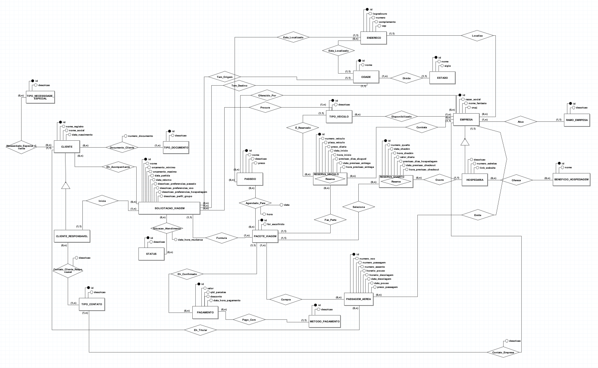
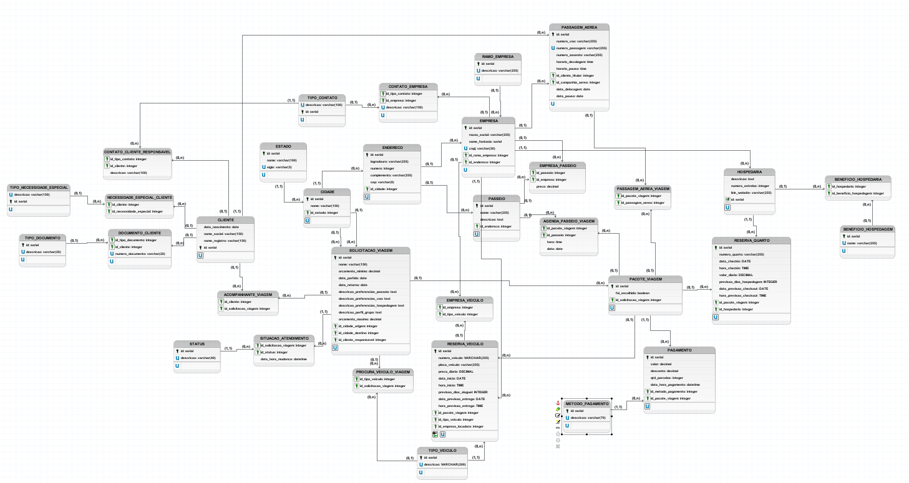

# TRABALHO 01:  Viagens BSI
Trabalho desenvolvido durante a disciplina de BD1 e AS (4º período de BSI)

# Sumário

### 1. COMPONENTES<br>
Integrantes do grupo<br>
Beatriz Auer Mariano: biaauer03@gmail.com<br>
Mateus Maioli Giacomin: matgiacomin@gmail.com<br>
<br>

### 2. INTRODUÇÃO<br>
O presente trabalho busca trabalhar diversos conceitos de análise de sistema e desenvolvimento de banco de dados relacional, tendo como base o seguinte cenário:<br>
<br>
A empresa “Viagens BSI” é uma agência de viagens 100% virtual que propõe, como modelo de negócios, auxiliar os clientes a montar seu roteiro de viagens de forma personalizada, fácil e acessível. Atualmente, a empresa opera com o mínimo viável para fornecer os seus serviços. Para tanto, utiliza atualmente ferramentas como Whatsapp, documentos de texto e planilhas para se comunicar com o cliente e guardar as informações da empresa e das propostas de viagens. Toda essa situação demanda tempo, que é uma métrica crítica para o negócio, e é incômodo para o agente, além de dificultar o acesso à informação. Por essas razões, a empresa busca um sistema de informação que seja capaz de fornecer para os agentes de viagens melhores ferramentas para a realização de seu trabalho, de modo a trazer velocidade e consistência, além de expandir o banco de conhecimento e fornecedores da empresa (rede de hospedagem, companhias aéreas, agências de aluguel de automóveis, rede turística, recomendações e pacotes fechados anteriormente para propostas similares, etc) e aumentar a segurança e integridade dos dados. Busca-se facilitar o acesso e recuperação de informações da empresa.<br>
<br>
[Acesse a documentação de requisitos e documentação de entrevistas com o cliente aqui.](doc/AS2023%20T1%20BA_MM.pdf)

### 3.MINI-MUNDO<br>

> A empresa “Viagens BSI” busca um sistema que auxilie os seus agentes de viagens a montar e gerenciar pacotes de viagens para seus clientes, de forma rápida e eficiente. Para isso, em um primeiro momento, o cliente entra em contato com a agência, informando seu nome e principais contatos. Uma série de informações devem ser coletadas sobre a viagem: quantidade de pessoas e idade de todos que irão viajar, além das preferências do grupo quanto a hospedagem, voo, passeios e transporte, o quanto está disposto a pagar, origem e destino, data de partida, data de retorno e se há alguma necessidade especial a ser atendida. Várias propostas de viagem, consistem em roteiros de viagem, são feitas e incluem os voos, a hospedagem, os passeios e o veículo a ser alugado. Cada proposta possui seu próprio valor, que não deve ultrapassar o orçamento do cliente.
> Caso o cliente se interesse por uma das propostas, ele pode comprar o pacote de viagens. Para efetivar a compra, ele deverá informar os dados dos pagamentos (ele poderá fazer mais de um pagamento com vários métodos de pagamento). Ele também deverá fornecer suas informações e das pessoas que o acompanharão na viagem, tais como: nome completo de registro, nome social, data de nascimento, e documentos de identificação (CPF, RG, CNH, certidão de nascimento, passaporte, etc), tripulante com necessidade especial e o tipo de necessidade especial. O agente só prosseguirá com as próximas etapas quando os pagamentos forem confirmados. Ao receber o pagamento total, as compras serão feitas: informações da compra dos voos (número de embarque, assentos, horário dos vôos, data dos voos, ponto de embarque, ponto de desembarque, companhia aérea, informações para check in e checkout, etc) - o bilhete comprado para as passagens deve ser redirecionado para o cliente, informações da hospedagem (endereço, nome, horário de check-in, data de check-in, número dos quartos, horário de check-out, data de check-out, contato), informações dos passeios (endereço, horário de início e fim de cada passeio, data de cada passeio, ingressos dos passeios, se houver) e dos veículos alugados (código do veículo, número da placa, cor, modelo, marca, endereço de retirada do veículo, horário de retirada do veículo, data de retirada do veículo, endereço de entrega do veículo, horário de entrega do veículo, data de entrega do veículo, contato). O agente é responsável pela compra de todos os itens do pacote com os entes externos (companhias aéreas, hospedagens, locais de visitação, etc). Caso o cliente não aceite as propostas, ele poderá pedir a modificação de uma que ele tenha gostado mais ou pedir uma nova rodada de propostas.
> Por fim, a empresa gostaria de ter uma forma eficaz de buscar informações para gerar relatórios, como: lugares mais visitados pelos clientes, melhores hotéis de cada cidade (mais comprados nos pacotes de viagens), agentes que mais vendem pacotes, para quais locais cada agente vende mais pacotes, faturamento da empresa em um determinado período de tempo, quantidade de propostas vendidas e perdidas em um determinado período do tempo.


### 3.PERGUNTAS A SEREM RESPONDIDAS<br>
    
A Empresa ViagensBSI precisa inicialmente dos seguintes relatórios:
> * Relatório que mostre os lugares mais visitados pelos clientes, por período e/ou idade dos clientes.
> * Quais os hotéis mais escolhidos pelos clientes no Brasil.
> * Quais os passeios mais escolhidos pelos clientes em cada cidade.
> * Quantidade de propostas vendidas e perdidas em um determinado período do tempo. 
> * Faturamento da empresa em um determinado período de tempo.
    
### 5.MODELO CONCEITUAL<br>

As principais tabelas do sistema são `CLIENTE`, `SOLICITACAO_VIAGEM` e `PACOTE_VIAGEM`. A maior parte das outras tabelas derivam de normalização, ou são partes que compõem essas tabelas principais e as suas relações.<br><br>
O principal fluxo do sistema consiste no seguinte: um cliente inicia uma solicitação de viagem, podendo, ou não, informar outros clientes acompanhantes. A partir dessa solicitação de viagem, pacotes de viagens são montados pelo agente de viagem. O cliente responsável por essa solicitação escolhe somente um para efetivar a compra. Por fim, é preciso registrar os dados resultantes dessa compra (reserva de hotel, passeios e veículos e passagens aéreas) e os dados de pagamentos.<br><br>
Abaixo, é apresentado uma imagem do modelo conceitual desenvolvido. Para ver com mais detalhes, carregue [esse arquivo](doc/Conceitual_v6_ViagensBSI.brM3) utilizando o [br modelo](aux/brModelo.jar)
        

    
#### 5.1 Validação do Modelo Conceitual
    [Grupo01]: [Lara, Rodolfo Oliveira e Erick Gama]
    [Grupo02]: [Filipe Moura, João Pedro, Marlon Ribeiro, Samuel Ferreira]

#### 5.2 Descrição dos dados <br>

A descrição dos dados pode ser encontrada [nesse documento](doc/descricao_dados.pdf).

#### 5.3 Melhorias futuras

Percebemos que algumas melhorias precisam ser feitas na versão futura do banco. A priori, são elas: <br>
* Controle interno da empresa, principalmente dos agentes de viagem
* Gerenciamento de quais viajantes irão em cada passeio
* Gerenciamento de ingressos de passeios pagos para quem vai no passeio, inclusive a cobrança dos passeios
* Gerenciamento de pagamentos, principalmente quanto ao valor do pacote de viagem (taxas, descontos, valor total)


### 6	MODELO LÓGICO<br>
A partir do modelo conceitual, utilizamos a ferramenta de conversão do BRModelo para gerar o modelo lógico.<br>
*Nota: Devido ao tamanho do modelo, o BRModelo travou bastante enquanto editávamos o modelo lógico. Por isso, optamos por excluir todas as relações geradas automaticamente e refazer manualmente (acredite, isso levou menos tempo do que continuar com o lag que estava). Por esse motivo, é possível que o modelo .brM3 esteje um pouco quebrado em suas relações. Mas isso não atrapalha e é possível fazer uma excelente conversão para o modelo físico posteriormente.*

Abaixo, é apresentado uma imagem do modelo lógico desenvolvido. Para ver com mais detalhes, carregue [esse arquivo](doc/Logico_v2_ViagensBSI.brM3) utilizando o [br modelo](aux/brModelo.jar)
        


### 7	MODELO FÍSICO<br>
A partir do modelo lógico, utilizamos a ferramenta de conversão do BRModelo para gerar o modelo físico. Conforme descrito no item anterior, o modelo gerado teve de ser modificado para ajustar os relacionamentos entre tabelas.<br>

Para finalizar o modelo físico, utilizamos o [ChatGPT](https://chat.openai.com/) para uniformizar o script (como colocar os tipos de dados em letras garrafais), adicionar constraints mínimos e gerar os constraints a partir de alteração de tabela. Após esse processo, analisamos o resultado e fizemos os últimos ajustes manualmente. Por fim, rodamos o script em um [validador de código sql](https://extendsclass.com/sql-validator.html) para tratar quaisquer error semânticos.<br>

O modelo gerado pelo BRModelo pode ser acessado [aqui](doc/fisico_v1_viagensBSI.sql). A versão final está salva [nesse arquivo de backup](doc/fisico_v4_viagensBSI.sql)

Inputs utilizados no ChatGPT:

    Preencha os constraints de sql corretamente para o modelo físico abaixo, por favor.
    <inclusão do modelo físico gerado pelo brmodelo>
<br>

    Agora, altere as instruções de criação de tabelas para incluir as constraints abaixo onde for mais adequado:

    NOT NULL - Ensures that a column cannot have a NULL value
    UNIQUE - Ensures that all values in a column are different
    PRIMARY KEY - A combination of a NOT NULL and UNIQUE. Uniquely identifies each row in a table
    FOREIGN KEY - Prevents actions that would destroy links between tables
    CHECK - Ensures that the values in a column satisfies a specific condition
    DEFAULT - Sets a default value for a column if no value is specified
    CREATE INDEX - Used to create and retrieve data from the database very quickly

    Também indique que as chaves primárias de cada tabela (id) é do tipo serial.
      
### 8	INSERT APLICADO NAS TABELAS DO BANCO DE DADOS<br>

O arquivo [inserts.sql](doc/inserts.sql) possui todos os dados de mock do banco de dados. Ele tem mais de mil linhas. Devido ao tamanho do banco, reduzimos a quantidade de dados nas tabelas, para otimizar o tempo (fazer as inserções levou duas semanas). E, claro, usamos bastante o ChatGPT aqui também para evitar trabalho manual: inserir dados repetitivos e inventados, como para passagens e reservas, e adaptar dados falsos obtidos através de geradores online para a estrutura da tabela. Além disso, também usamos alguns scripts em python para inserir dados das tabelas associativas. <br>

Exemplo do código usado para inserir os benefícios de uma hospedaria:
```
for i in range(8, 30):
	for j in range(1, 6):
		randomNumber = random.randrange(1, 21)
		print(f"({i}, {randomNumber}),")
```
Por fim, criamos um [arquivo de backup](doc/backup.sql) de todo o banco. 

### 9	TABELAS E PRINCIPAIS CONSULTAS<br>

[Acesse o colab aqui](https://colab.research.google.com/drive/1yDsro_31TCfamYGXOm6NuCK0rTMcajjc?usp=sharing)

### 10 Extra

[Relatório das sprints](doc/Relatórios%20das%20sprints.pdf)